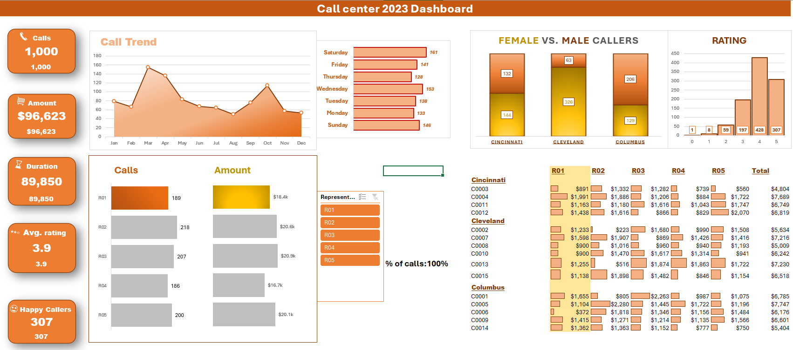
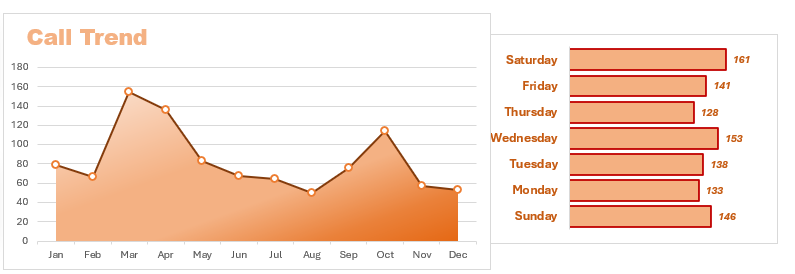
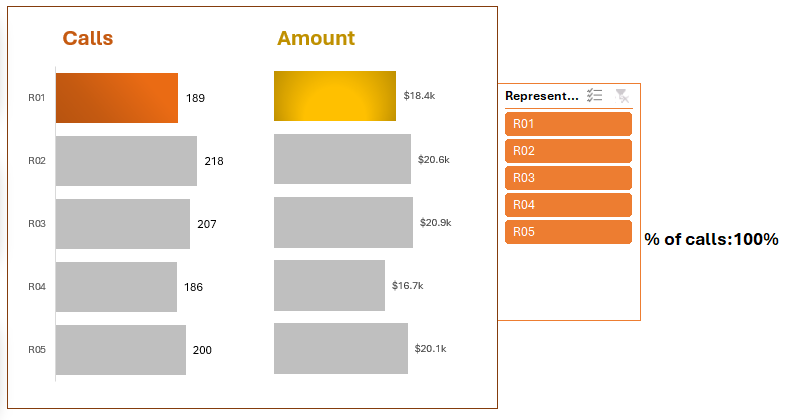
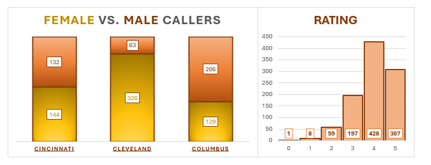
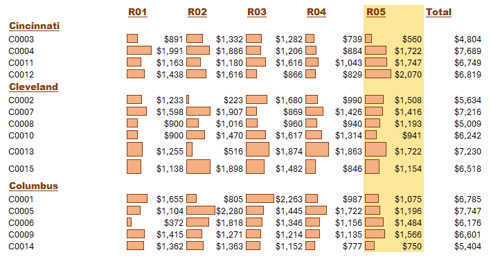

# Call Center Data Analysis Dashboard

--

## Introduction
it's a call center dashboard where managers want to know the performance of their team based on KPIs etc ...
The data is from an Excel document, which provides a foundation in analyzing data using Power Pivot,interactive Pivot Charts with slicers,conditional formatting. The data contains detailed information on Call number,Customer ID,Purchase Amount,Satisfaction Rating,Duration Bucket,City etc...

## Dashboard File
My final [dashboard](https://github.com/Othmane-data/Call-Center-Data-Analysis-Report-by-Excel/blob/main/Call-Center-data-excel-portfolio-project.xlsx)

## Problem statement
1. What is the count of calls for each day and month?
2. What is the count of calls and the total amount for each Representative?
3. What is the count of Rating,of calls by Gender and by City?
4. What is the total amount by Customer ID,by City and by each Representative?

## Skills/ concepts demonstrated
- 🧮 KPIs,Power Pivot,DAX,Formulas and Functions
- 📉 Interactive Pivot Charts with slicers and Visualization
- ❎ Conclusion and Recommendations


### 🧮 DAX,KPIs,Power Pivot,Formulas and Functions:

- DAX;
```
- Call count=COUNTROWS(calls)

- Total amount=SUM(calls[Purchase Amount])

- Total duration=SUM([Duration])

- Avr. rating=AVERAGE(calls[Satisfaction Rating])

- 5* calls=CALCULATE([call count],calls[Rating rounded]=5)
  
```
  
- Formulas and Functions;
```
- Sales and Amount selection by representative =IF
                                                 (F49=J$45,G49,NA())

-the total amount by Customer ID,by City and by each Representative=IF
                                             (pivots!D82:J99="","",pivots!D82:J99)

-Conditional Color Format of total amount=MAX
                                        ($S$24:$W$40)*2

-Conditional Color Format of Representative=
                                            S$22=pivots!$B$59

-Representative summary by Calls=XLOOKUP
                                 (B59,F49:F53,G49:G53)

-Representative summary by Amount=XLOOKUP
                                  (B59,F49:F53,H49:H53)

-Representative summary Call and Amount rank=RANK.AVG
                                            (G58,G49:G53)

```

### 📉 Interactive Pivot Charts with slicers and Visualization:
The report comprises 4 charts:

___1. Count of calls for each day and month;___

___2. Count of calls and the total amount for each Representative;___

___3. Count of Rating,of calls by Gender and by City;___

___4. Total amount by Customer ID,by City and by each Representative___

we're use the pivot table for every shart

__- Features:__
- Total KPIs and KPIs by Representative;
- Representative Slicer.

the all dashboard 


___1. Count of calls for each day and month;___



____March___ and ___April___ are the months which marked the large number of calls with ___150___ calls in March and ___140___ in April._

_- for the days of the week ___Saturday___ and ___Wednesday___ always mark the large number of calls. 🤓_

___2. Count of calls and the total amount for each Representative;___



_Representatives ___R02___ and ___R03___ have the highest number of calls with ___218 and 207___ which automatically means they will have the highest amount with __$20.6k__ for __R02__ and __$20.9k__ for __R03__ . 🤓_

___3. Count of Rating,of calls by Gender and by City;___



_in the city of __Cleveland___ __women__ dominate the number of calls marked with more than __326 calls__, on the other side in the city of ___Columbus___ the __male gender__ has the high number of calls with a figure of __206 calls__. 🤓_

_A Number of __428 calls__ which have __4 stars__ in satisfaction rating and __307__ have __5 stars__ on the other hand only __8 calls__ have __1 star__, this means that the representatives of this call center make a great effort to satisfy their customers 🤓_

___4. Total amount by Customer ID,by City and by each Representative___



_This table represents the amount of each representative in this call center by city and by Customer ID . 🤓_

### ❎ Conclusion and Recommendations :

Push the representative R01 and R04 to make a large number of calls focusing on other cities and make more effort to satisfy their customers. 😄
