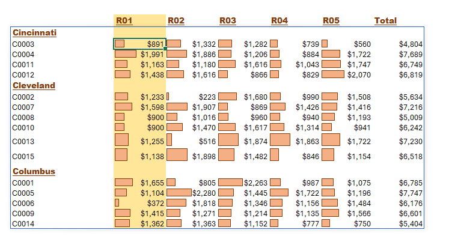

# Call Center Data Analysis Dashboard

--

## Introduction
it's a call center dashboard where managers want to know the performance of their team based on KPIs etc ...
The data is from an Excel document, which provides a foundation in analyzing data using Power Pivot,interactive Pivot Charts with slicers,conditional formatting. The data contains detailed information on Call number,Customer ID,Purchase Amount,Satisfaction Rating,Duration Bucket,City etc...

## Dashboard File
My final [dashboard](https://github.com/Othmane-data/Call-Center-Data-Analysis-Report-by-Excel/blob/main/Call-Center-data-excel-portfolio-project.xlsx)

## Problem statement
1. What is the count of calls for each day and month?
2. What is the count of calls and the total amount for each Representative?
3. What is the count of calls by Gender and by City?
4. What is the total amount by Customer ID,by City and by each Representative?

## Skills/ concepts demonstrated
- 🧮 KPIs,Power Pivot,DAX,Formulas and Functions
- 📉 Interactive Pivot Charts with slicers and Visualization
- ❎ Conclusion and Recommendations


### 🧮 DAX,KPIs,Power Pivot,Formulas and Functions:

- DAX;
```
- Call count=COUNTROWS(calls)

- Total amount=SUM(calls[Purchase Amount])

- Total duration=SUM([Duration])

- Avr. rating=AVERAGE(calls[Satisfaction Rating])

- 5* calls=CALCULATE([call count],calls[Rating rounded]=5)
  
```
  
- Formulas and Functions;
```
- Sales and Amount selection by representative =IF
                                                 (F49=J$45,G49,NA())

-the total amount by Customer ID,by City and by each Representative=IF
                                             (pivots!D82:J99="","",pivots!D82:J99)

-Conditional Color Format of total amount=MAX
                                        ($S$24:$W$40)*2

-Conditional Color Format of Representative=
                                            S$22=pivots!$B$59

-Representative summary by Calls=XLOOKUP
                                 (B59,F49:F53,G49:G53)

-Representative summary by Amount=XLOOKUP
                                  (B59,F49:F53,H49:H53)

-Representative summary Call and Amount rank=RANK.AVG
                                            (G58,G49:G53)

```

### 📉 Interactive Pivot Charts with slicers and Visualization:
The report comprises 4 charts:

___1. Count of calls for each day and month;___

___2. Count of calls and the total amount for each Representative;___

___3. Count of calls by Gender and by City;___

___4. Total amount by Customer ID,by City and by each Representative___

we're use the pivot table for every shart

__- Features:__
- Total KPIs and KPIs by Representative;
- Representative Slicer.

the all dashboard 


___1. Count of calls for each day and month;___


_March, January and February are the months which marked the top sales with ___1.92 M,1.88 M and 1.82 M___ sum of amount and ___2819,2750 and 2720___ orders. 🤓_

___2. Count of calls and the total amount for each Representative;___


_Women are more likely to buy compared to men with 65% . 🤓_

___3. Count of calls by Gender and by City;___

  

_this store deliver in 2022 more than ___28641___ orders . 🤓_

___4. Total amount by Customer ID,by City and by each Representative___



_MAHARASHTRA,KARNATAKA and UTTAR PRADESH are the top 3 states with 69,54 % . 🤓_
